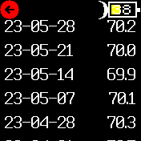
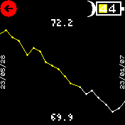

# Heft Log

Heft Log is a weight tracking application designed for Bangle.js devices. It allows Bangle.js users to log and monitor their weight over time. It's meant to be an easy and convenient way to track your progress and stay motivated on your fitness journey.

## Installation

Heft Log is not yet available in the official [Bangle.js app loader]. For now it can be installed by uploading the files in the `src/` directory directly to the Bangle.js internal storage using the [Espruino Web IDE].

At the repository's root, there's also other relevant items:

- `heftlog.info.js`, a script to generate the `heftlog.info` file inside the Bangle.js device directly from the [Espruino Web IDE]'s terminal window.
- `heftlog.json`, an example log file as it would be generated by the app.
- `screenshots/`, a directory with some screenshots of the app.
- `weight-scale.png`, the app icon in full sized png (as created by [Flat-icons-com]), which can be converted (check the [Espruino Image Converter]) and uploaded to the device.

## Usage

- Load the app onto your device and start it by selecting it in the [launcher].
- When you run Heft Log for the first time, it will guide you through setting your height (in centimeters). This is used to calculate your [Body Mass Index] (BMI), a reasonable rule of thumb to – roughly – categorize someone's height.
- When the height is already set, the app will open a menu with various options:
  1. **Log weight**: Record your weight at a given time. The app stores one record per day, overwriting previous entries if necessary.
  2. **Show Log**: Display a scrollable list of all logged weights, including the date of each entry.
  3. **Load graph**: Visualize the log as line chart, showing the weight variance over time.
  4. **Change height**: Modify your registered height.
  5. **Exit**: Close the app.
- Use the "back" widget (the red circle) or a button press to navigate back from each option to the main menu.

## Screenshots

## To-do's

- [ ] When registering a second weigh on the same day, prompt users if they want to overwrite the previous record or not.[¹]
- [ ] Add a menu option to allow users to clear their data or trim the log to save memory.

[¹]: # (Prompt options: 'Overwrite\nweight record?', 'File a new\nweight record?')

## License

Following [Espruino's recommendation], Heft Log is [MIT license]d. See `License.md` for more details.

***
[Bangle.js app loader]: https://banglejs.com/apps/
[Espruino Web IDE]: https://www.espruino.com/ide/
[Flat-icons-com]: https://www.flaticon.com/authors/flat-icons-com
[Espruino Image Converter]: https://www.espruino.com/Image+Converter
[launcher]: https://banglejs.com/apps/?c=launch
[Body Mass Index]: https://en.wikipedia.org/wiki/Body_mass_index
[Espruino's recommendation]: https://www.espruino.com/Bangle.js+App+Loader
[MIT license]: https://en.wikipedia.org/wiki/MIT_License
